# Install

This guide will have you set up Supabase, the database platform that Koi is using,
set up an account and database, restore the initial schema, and start Koi with
the connection strings from Supabase.

This guide will take approximately 20 to 30 minutes.

- Make sure you have [`pnpm` installed][pnpm-install]. (estimate: 5 minutes)

[pnpm-install]: https://pnpm.io/installation

- Clone the repository. (estimate: 2 minutes)

```
git clone git@github.com:Purdue-CS407-Koi/Koi.git
```

If you are getting an error about SSH or authentication, try cloning over HTTP:

```
git clone https://github.com/Purdue-CS407-Koi/Koi.git
```

- Check out the `sprint-1` tag in this repository, as we want to avoid having
  commits from future sprints from conflicting with this guide. This guide was
  written with the code from Sprint 1 in mind, so if you use newer commits you
  may end up with a newer codebase trying to interact with an older schema!

```
git checkout sprint-1
```

- Sign up for an account on Supabase. (estimate: 5 minutes)
- Create a new organization and give it a name. For this tutorial, we'll use
  "Koi-reinstall-demo". Leave Type at "Personal" and Plan at "Free - $0/month".
  (estimate: 3 minutes)

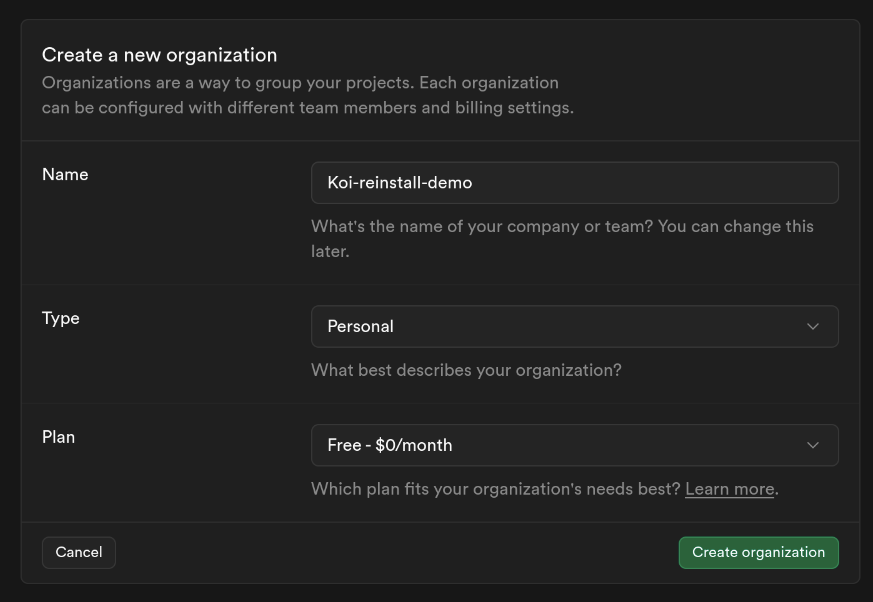

- Supabase will prompt you to create a new project. Fill in the project name and
  type in a database password. We'll use "Koi-reinstall" as the project name for
  this guide. Type in and remember the database password. You can leave the region
  at "Americas". You do not need to change any other settings on the bottom, such
  as "Security Options" and "Advanced Configuration." (estimate: 3 minutes)

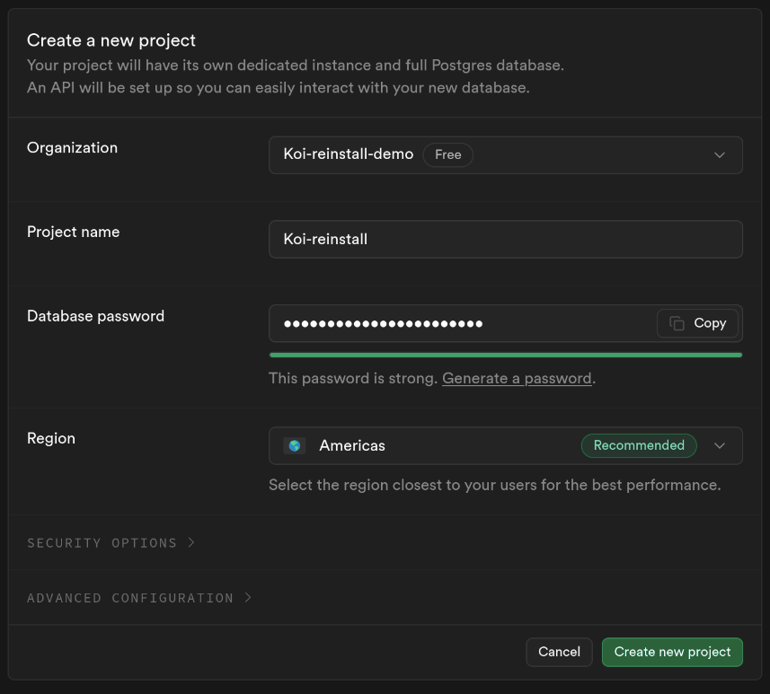

- Once the new project is created, we need to restore the database schema that is
  saved in this repository. Install the PostgreSQL CLI, `psql`, [by following the
  official instructions on the PostgreSQL website][psql-download]. (estimate:
  10 minutes)

[psql-download]: https://www.postgresql.org/download/

- Go back to the project page on Supabase and click on the Connect button at the
  top bar.

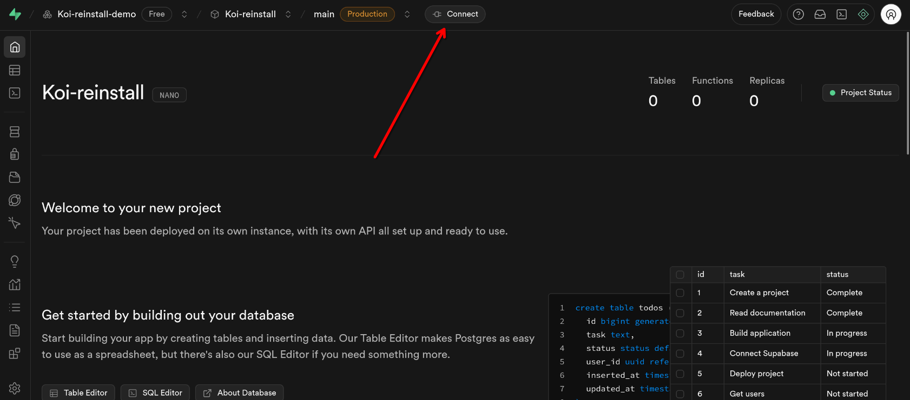

- Click on the "Method" dropdown and choose "Session pooler." "Direct connection"
  does not support connections from IPv4, and to avoid problems we'll just use
  "Session pooler."

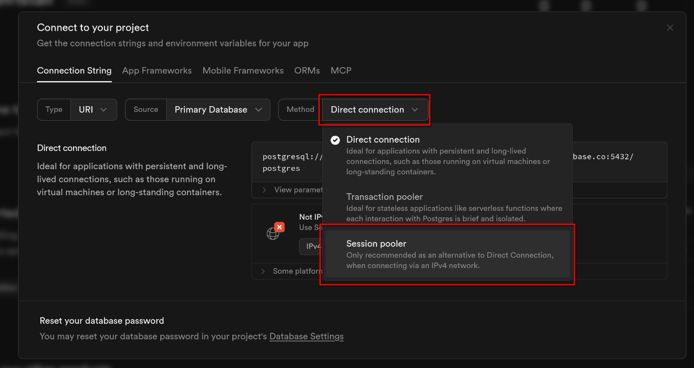

- Copy the connection string. Remember to replace `[YOUR-PASSWORD]` with the
  database password you set earlier.

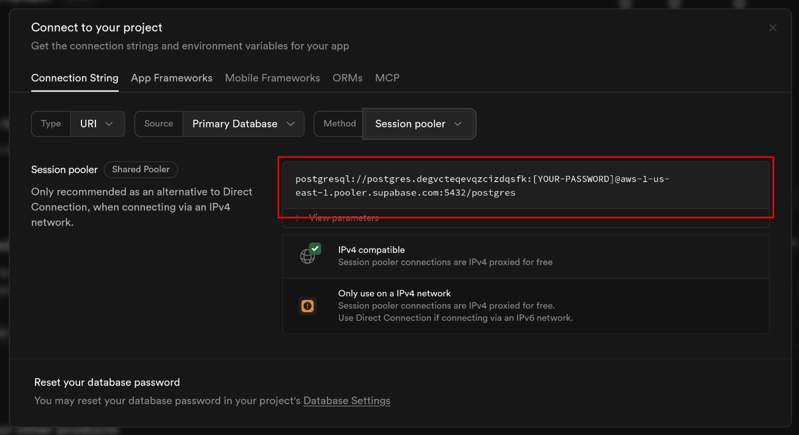

- Type in the following command, replacing `[CONNECTION-STRING]` with your
  connection string from above. (estimate: 1 minute)

```
psql \
  --single-transaction \
  --variable ON_ERROR_STOP=1 \
  --file supabase_backup/roles.sql \
  --file supabase_backup/schema.sql \
  --command 'SET session_replication_role = replica' \
  --dbname [CONNECTION_STRING]
```

- Go to the Supabase project dashboard, click "Table Editor" in the left sidebar,
  and verify that you can see the restored tables from the schema.

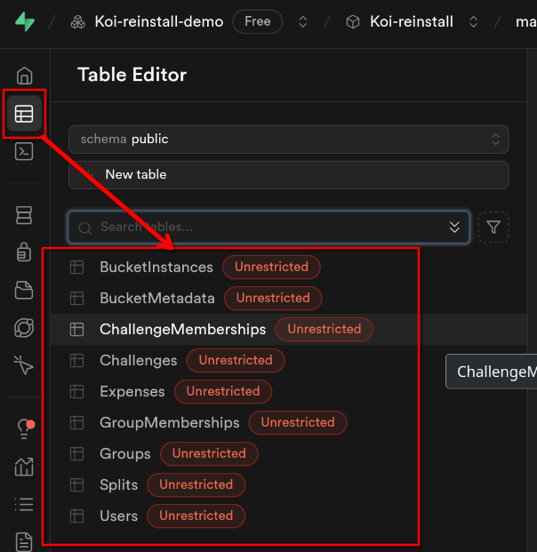

- Now we need to save the API URL and the Supabase key to the repository's
  environment variable file so that Koi can connect to Supabase. Click on the
  "Connect" button from above, choose "App Frameworks", and change the dropdowns
  to the following options:
  - Framework: React
  - Using: Vite
  - With: Supabase-js

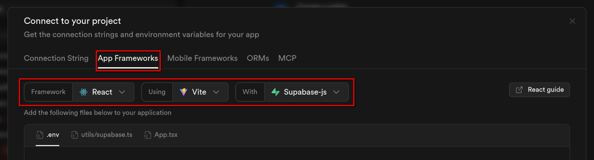

- Copy the contents of the `.env` file and save it to the root of the repository,
  in a file named `.env`.

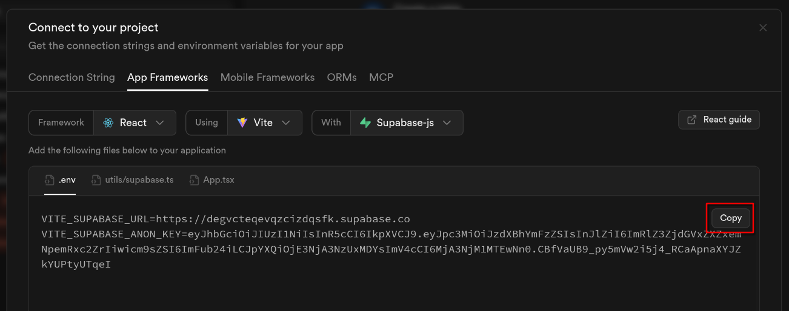

- Before you launch Koi, there are a couple of configuration options you need to
  change. Click on the "Authentication" icon on the left, choose "Sign In/Providers",
  and disable the "Confirm email" option. We want to avoid sending out confirmation
  emails during the development period.

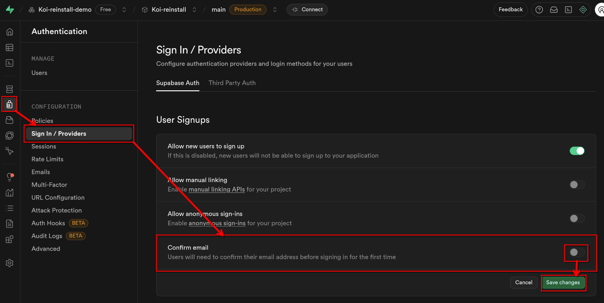

- Now you are ready to start Koi. Run the following command:

```
pnpm run dev
```

- Visit the following URL in your browser: [http://localhost:5173/](http://localhost:5173/)
  - **If** you get an error, check the terminal window and see if you have a
    different port number assigned. It is possible other services running on your
    machine is using port `5173`, so Vite chose another port automatically.

- To test if the connection is working properly, use the sign up form. You should
  see a new account in the "Users" table.

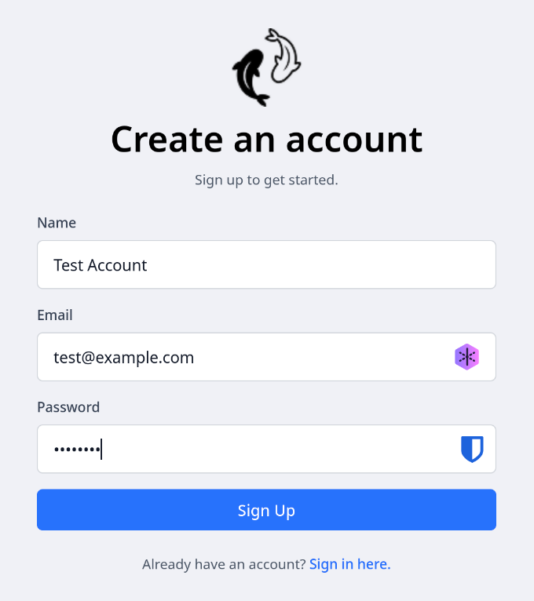

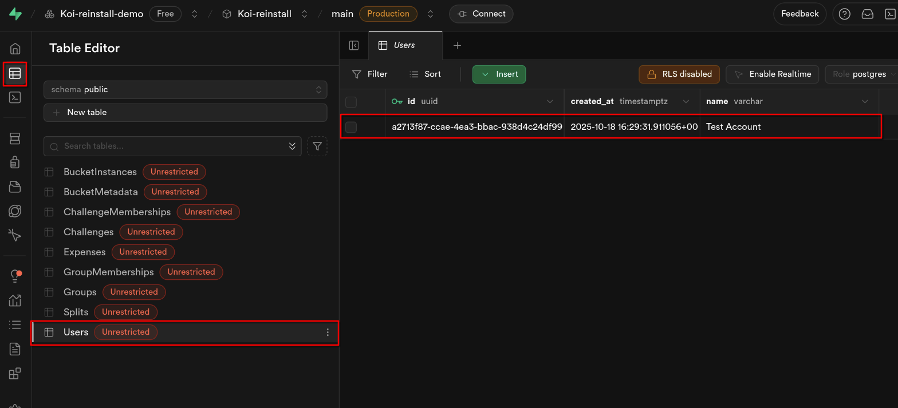

You should now have a properly-working Koi instance!
